# Monisha Inventory Management System - Complete Blueprint

## 🎯 How the System Works (Overview)

The Monisha Inventory Web App is designed to act as the central nervous system of the uniform business, ensuring that production, stock, school allocations, and sales all flow in a clear and connected way. At its core, the system is built around a **Batch-first approach**, which means everything begins from the production batches recorded in the warehouse.

### The Complete Business Flow

**When new uniforms are produced**, they are entered into the **Batch Inventory**. This is the central hub of the system, representing the real-life warehouse. Each batch contains important details such as the type of uniform (e.g., blazers, shirts, or trousers), the variants available (sizes, colors, gender), the quantities produced, and the cost price of production. Nothing is tied to a school at this point — it is simply a record of what has been manufactured and is now sitting in stock.

**From there**, the system allows managers or staff to move into the **Product Inventory**, which is where the school-level allocation begins. When adding a product here, the user must choose from the uniform types that exist in the Batch Inventory. For example, if a batch of "Navy Blue Blazers" was created in the warehouse, that uniform type will now appear in the Product Inventory's dropdown menu. Once selected, the system automatically loads the variants that were defined in the batch (for instance, blazer sizes S, M, and L). This prevents errors like adding uniforms that don't exist or inventing new sizes by mistake.

**The key difference** at this stage is that the product is now tied to a specific school. In other words, the Product Inventory doesn't just say "there are blazers in stock" — it says "St. Mary's School has 20 blazers allocated from Batch A." This allocation still traces back to the central Batch Inventory, so everything stays in sync between the warehouse and the schools.

**When schools (or individual customers) place orders**, the system checks the Product Inventory, which is already linked to the Batch Inventory. If stock is available, the system deducts it using the FIFO (First In, First Out) principle to ensure older stock is sold first. It then generates an order record with invoices, payment status, and delivery information. At the same time, both the school's allocation and the original batch balance are updated in real time, ensuring no "ghost stock" remains.

**The Dashboard and Reports** bring all of this together by giving managers an overview of the entire business: how much stock is left per batch, how many products are allocated per school, which uniforms are selling the most, and where profits are being made. This makes it easy to spot trends, prevent shortages, and plan future production runs.

### Data Flow Summary

In summary, the Monisha Inventory Web App runs like a **waterfall of data**:

1. **Batch Inventory** (warehouse stock) is the starting point
2. **Product Inventory** (school allocation) flows directly from it
3. **Orders** flow from the product allocations
4. **Reports** flow from everything

By keeping **Batch Inventory as the center of truth**, the app guarantees that every product added, every order processed, and every report generated is grounded in real stock that physically exists. This prevents errors, saves time, and provides a professional system for managing uniforms across multiple schools.

---

## 📋 Table of Contents
- [Overview](#overview)
- [Technical Architecture](#technical-architecture)
- [Database Schema](#database-schema)
- [Authentication & Roles](#authentication--roles)
- [Core Features](#core-features)
- [Application Flow](#application-flow)
- [API & Data Management](#api--data-management)
- [Security & Performance](#security--performance)
- [Deployment](#deployment)
- [Future Roadmap](#future-roadmap)

## 🎯 Overview

**Monisha Inventory Management System** is a comprehensive React-based web application designed for school uniform manufacturing and distribution. It serves as a complete business management solution for uniform suppliers working with multiple schools.

### Key Business Value
- Streamlines uniform production and distribution
- Real-time inventory tracking across multiple batches
- School-specific order management
- Role-based access control for team collaboration
- Comprehensive reporting and analytics

### Target Users
- **Super Admin**: System owner with full access
- **Managers**: Inventory managers with operational control
- **Staff**: Front-line employees with limited access

## 🏗️ Technical Architecture

### Frontend Stack
```
React 18.3.1          - Modern UI framework
Vite 6.0.7            - Fast build tool
React Router 7.1.1    - Client-side routing
Tailwind CSS 3.4.17   - Utility-first styling
Zustand 5.0.3         - Lightweight state management
Framer Motion 11.18.0 - Smooth animations
```

### Backend & Database
```
Firebase 11.1.0       - Backend-as-a-Service
Firestore             - NoSQL document database
Firebase Auth         - Authentication service
Firebase Storage      - File storage service
```

### Project Structure
```
src/
├── components/       # Reusable UI components
├── pages/           # Route-level components
├── stores/          # Zustand state management
├── config/          # Firebase configuration
├── utils/           # Helper functions
├── assets/          # Static assets
└── styles/          # Global styles
```

## 🗄️ Database Schema

### Core Collections

#### 1. `uniforms` - Product Catalog
```javascript
{
  id: "auto-generated",
  name: "School Blazer",
  description: "High-quality school blazer for daily wear",
  category: "Outerwear",
  schoolId: "optional-school-reference",
  isActive: true,
  media: [
    {
      url: "https://storage.url/image.jpg",
      type: "image"
    }
  ],
  createdAt: "2024-01-15T10:30:00Z",
  updatedAt: "2024-01-15T10:30:00Z"
}
```

#### 2. `uniform_variants` - Product Variations
```javascript
{
  id: "variant-id",
  uniformId: "uniform-reference",
  type: "Boys", // or "Girls"
  color: "Navy Blue",
  sizes: [
    {
      size: "S",
      price: 15.99,        // SELLING PRICE (customer-facing)
      sku: "BLZR-NAVY-S"
    },
    {
      size: "M", 
      price: 16.99,
      sku: "BLZR-NAVY-M"
    }
  ],
  createdAt: "2024-01-15T10:30:00Z"
}
```

#### 3. `batchInventory` - Stock Management
```javascript
{
  id: "batch-id",
  batchName: "Summer 2024 Production",
  createdAt: "2024-01-15T10:30:00Z",
  items: [
    {
      uniformId: "uniform-reference",
      variantId: "variant-reference", 
      sizes: [
        {
          size: "S",
          quantity: 50,      // AVAILABLE STOCK
          sku: "BLZR-NAVY-S",
          price: 8.50        // COST PRICE (internal only)
        }
      ]
    }
  ]
}
```

#### 4. `schools` - School Management
```javascript
{
  id: "school-id",
  name: "ABC International School",
  address: "123 Education Street, City",
  contactPerson: "Principal John Doe",
  contactEmail: "principal@abcschool.edu",
  contactPhone: "+1-555-0123",
  studentCount: 500,
  status: "active",
  students: [
    {
      id: "student-id",
      name: "Jane Smith",
      grade: "Grade 5",
      section: "A",
      rollNumber: "2024-05-001",
      uniformInventory: {
        "uniform-id": {
          "variant-id": {
            "S": { quantity: 2, status: "issued" }
          }
        }
      },
      createdAt: "2024-01-15T10:30:00Z"
    }
  ],
  uniformRequirements: {
    "uniform-id": {
      required: true,
      defaultQuantity: 2,
      notes: "Required for all students"
    }
  }
}
```

#### 5. `orders` - Transaction Management
```javascript
{
  id: "order-id",
  orderNumber: "ORD-2024-001",
  source: "inventory",     // "inventory" or "ecommerce"
  status: "pending",       // pending/processing/shipped/completed/cancelled
  schoolId: "school-reference",
  customerId: "optional-customer-id",
  customerInfo: {
    name: "School Admin",
    email: "admin@school.edu",
    shippingAddress: "School Address"
  },
  items: [
    {
      uniformId: "uniform-reference",
      variantId: "variant-reference",
      sku: "BLZR-NAVY-S",
      name: "Navy Blue Blazer",
      size: "S",
      quantity: 10,
      unitPrice: 15.99
    }
  ],
  totalAmount: 159.90,
  paymentDetails: {
    paymentId: "stripe-payment-id",
    status: "paid"          // paid/pending/refunded
  },
  createdAt: "2024-01-15T10:30:00Z",
  updatedAt: "2024-01-15T10:30:00Z"
}
```

#### 6. User Collections
```javascript
// inventory_managers
{
  id: "user-uid",
  name: "Manager Name",
  email: "manager@company.com",
  role: "manager",
  appOrigin: "inventory",
  createdAt: "2024-01-15T10:30:00Z"
}

// inventory_staff  
{
  id: "user-uid",
  name: "Staff Name", 
  email: "staff@company.com",
  role: "staff",
  appOrigin: "inventory",
  pendingManagerRequest: false,
  createdAt: "2024-01-15T10:30:00Z"
}
```

### Data Relationships & Inventory Architecture

#### Core Inventory Concept
The system uses a **two-tier inventory architecture**:
1. **Product Catalog** (`uniforms` + `uniform_variants`) - Defines WHAT can be sold
2. **Physical Inventory** (`batchInventory`) - Tracks WHAT is actually in stock

#### Relationship Flow
```
uniforms (1) ←→ (N) uniform_variants ←→ (N) batchInventory.items
    ↓                    ↓                        ↓
Product Info      Selling Prices         Physical Stock
```

#### Inventory Data Sharing Model


#### Critical Data Connections
- **uniformId**: Links variants to their parent uniform
- **variantId**: Links batch items to their variant specifications  
- **sku**: Unique identifier that connects all three systems
- **Atomic Updates**: When stock is sold, both batchInventory and orders are updated in a single transaction

## 👥 Authentication & Roles

### Role Hierarchy
```
Super Admin (tinashegomo96@gmail.com)
├── Full system access
├── User management
├── System configuration
└── All manager + staff permissions

Manager (inventory_managers collection)
├── Inventory management
├── Batch operations  
├── School management
├── Reports & analytics
└── All staff permissions

Staff (inventory_staff collection)
├── Basic inventory operations
├── Order processing
└── Limited reporting
```

### Authentication Flow
```javascript
// Firebase Auth integration
onAuthStateChanged(auth, async (user) => {
  if (user) {
    setUser(user);
    await fetchUserProfile(user.uid);
    // Check role in inventory_managers or inventory_staff
  } else {
    setUser(null);
  }
});
```

### Permission Matrix
| Feature | Super Admin | Manager | Staff |
|---------|-------------|---------|-------|
| User Management | ✅ | ✅ | ❌ |
| School CRUD | ✅ | ✅ | ❌ |
| Inventory Management | ✅ | ✅ | ✅ |
| Batch Management | ✅ | ✅ | ❌ |
| Order Processing | ✅ | ✅ | ✅ |
| Reports | ✅ | ✅ | 📊 Limited |
| Settings | ✅ | ❌ | ❌ |

## 🎯 Core Features

### 1. Dashboard
**Real-time Business Intelligence**
- Total revenue and profit metrics
- Current stock levels across all batches
- Low stock alerts (configurable thresholds)
- Pending orders count
- Recent transactions
- Interactive charts (sales trends, inventory turnover)
- Quick action buttons for common tasks

### 2. Inventory Management
**Comprehensive Product Catalog**
- **Uniform Types**: Blazers, Shirts, Trousers, Skirts, etc.
- **Variant Management**: Size, color, material combinations
- **SKU Generation**: Automatic unique identifiers
- **Stock Tracking**: Real-time inventory across batches
- **Search & Filter**: Advanced filtering by multiple criteria
- **Bulk Operations**: Mass updates and imports

### 3. School Management
**Complete School Lifecycle**
- **School Profiles**: Contact info, student counts, requirements
- **Student Management**: Individual student records
- **Uniform Requirements**: School-specific uniform policies
- **Custom Allocations**: Per-student uniform quantities
- **Order History**: Complete transaction audit trail
- **Communication**: Contact management and notes

### 4. Batch Management
**Production Tracking**
- **Batch Creation**: New production runs with items
- **Status Tracking**: In Progress → Completed → Distributed
- **Cost Management**: Track material and labor costs
- **Supplier Integration**: Link batches to suppliers
- **Quality Control**: Batch quality metrics
- **FIFO Management**: First-in, first-out inventory

### 5. Order & Transaction Management
**End-to-end Order Processing**
- **Order Creation**: Multi-item school orders
- **Payment Tracking**: Integration with payment gateways
- **Status Updates**: Real-time order progression
- **Invoice Generation**: Automatic PDF invoices
- **Return Management**: Handle returns and exchanges
- **Notification System**: Automated status updates

### 6. Reports & Analytics
**Business Intelligence**
- **Sales Reports**: Revenue trends and analysis
- **Inventory Reports**: Stock levels and turnover
- **School Analytics**: Per-school performance metrics
- **Batch Efficiency**: Production cost analysis
- **Forecasting**: Demand prediction and planning
- **Export Options**: PDF, Excel, CSV formats

### 7. User Management
**Team Collaboration**
- **Role Assignment**: Manager/Staff role management
- **Profile Management**: User information updates
- **Access Control**: Feature-level permissions
- **Activity Logging**: User action audit trails
- **Team Communication**: Internal messaging system

## 🔄 Application Flow

### Product Display Flow

```mermaid
graph TD
    A[Load Products Page] --> B[Fetch Active Uniforms from 'uniforms']
    B --> C[For Each Uniform: Fetch Variants from 'uniform_variants']
    C --> D[For Each SKU: Sum Stock from ALL 'batchInventory' batches]
    D --> E[Combine: uniformId + variantId + calculated stock]
    E --> F[Final Product Object: Name + Price + Available Stock]
    F --> G[Display Product Grid]
    
    H[Key Connections:] --> I[uniformId links uniforms ↔ variants]
    I --> J[variantId + sku links variants ↔ batch items]
    J --> K[Stock = SUM of quantities across all batches for same SKU]
```


### Product Addition Flow (Cross-System Integration)

```mermaid
graph TD
    A[Add New Product] --> B[Create Uniform Record]
    B --> C[Generate uniformId]
    C --> D[Create Uniform Variants]
    D --> E[Generate variantId + SKUs]
    E --> F[Create/Update Batch Inventory]
    F --> G[Link via uniformId + variantId]
    G --> H[Stock becomes available for sale]
    
    I[Data Flow:] --> J[uniforms.id → uniform_variants.uniformId]
    J --> K[uniform_variants.id → batchInventory.items.variantId]
    K --> L[uniform_variants.sku ↔ batchInventory.items.sku]
```


### Inventory Update Process


### Order Processing Flow


### User Authentication Flow


### Inventory Data Synchronization

#### How the Three Systems Work Together

**1. Product Creation Process:**
```javascript
// Step 1: Create base uniform
const uniform = await addDoc(collection(db, 'uniforms'), {
  name: "School Blazer",
  category: "Outerwear",
  isActive: true
});

// Step 2: Create variants with pricing
const variant = await addDoc(collection(db, 'uniform_variants'), {
  uniformId: uniform.id,  // 🔗 CRITICAL LINK
  color: "Navy Blue",
  sizes: [
    { size: "S", price: 15.99, sku: "BLZR-NAVY-S" },
    { size: "M", price: 16.99, sku: "BLZR-NAVY-M" }
  ]
});

// Step 3: Add physical stock to batch
await updateDoc(doc(db, 'batchInventory', batchId), {
  items: arrayUnion({
    uniformId: uniform.id,    // 🔗 LINKS TO UNIFORM
    variantId: variant.id,    // 🔗 LINKS TO VARIANT
    sizes: [
      { size: "S", quantity: 50, sku: "BLZR-NAVY-S", price: 8.50 },
      { size: "M", quantity: 35, sku: "BLZR-NAVY-M", price: 9.00 }
    ]
  })
});
```

**2. Stock Calculation (Real-time):**
```javascript
// To get available stock for a SKU, sum across ALL batches
const getAvailableStock = async (sku) => {
  const batchesSnapshot = await getDocs(collection(db, 'batchInventory'));
  let totalStock = 0;
  
  batchesSnapshot.docs.forEach(batchDoc => {
    const batch = batchDoc.data();
    batch.items.forEach(item => {
      item.sizes.forEach(sizeInfo => {
        if (sizeInfo.sku === sku) {
          totalStock += sizeInfo.quantity; // 📊 SUM ACROSS BATCHES
        }
      });
    });
  });
  
  return totalStock;
};
```

**3. Order Processing (Atomic Updates):**
```javascript
// When an order is placed, update stock atomically
const processOrder = async (orderItems) => {
  await runTransaction(db, async (transaction) => {
    // Read all relevant batches
    const batchRefs = await getDocs(collection(db, 'batchInventory'));
    
    for (const item of orderItems) {
      let remainingToDeduct = item.quantity;
      
      // Deduct from batches using FIFO (oldest first)
      for (const batchDoc of batchRefs.docs) {
        if (remainingToDeduct <= 0) break;
        
        const batchData = batchDoc.data();
        const batchItemIndex = batchData.items.findIndex(
          batchItem => batchItem.uniformId === item.uniformId && 
                      batchItem.variantId === item.variantId
        );
        
        if (batchItemIndex > -1) {
          const sizeIndex = batchData.items[batchItemIndex].sizes.findIndex(
            size => size.sku === item.sku
          );
          
          if (sizeIndex > -1) {
            const available = batchData.items[batchItemIndex].sizes[sizeIndex].quantity;
            const toDeduct = Math.min(available, remainingToDeduct);
            
            // 🔄 UPDATE BATCH STOCK
            batchData.items[batchItemIndex].sizes[sizeIndex].quantity -= toDeduct;
            remainingToDeduct -= toDeduct;
            
            transaction.update(batchDoc.ref, { items: batchData.items });
          }
        }
      }
    }
    
    // 📝 CREATE ORDER RECORD
    transaction.set(doc(collection(db, 'orders')), {
      items: orderItems,
      status: 'pending',
      createdAt: new Date()
    });
  });
};
```

#### Key Integration Points

| System | Purpose | Key Fields | Links To |
|--------|---------|------------|----------|
| `uniforms` | Product Catalog | `id`, `name`, `category` | `uniform_variants.uniformId` |
| `uniform_variants` | Pricing & SKUs | `uniformId`, `id`, `sku`, `price` | `batchInventory.items.variantId` |
| `batchInventory` | Physical Stock | `items[].uniformId`, `items[].variantId`, `quantity` | Both above systems |

#### Data Consistency Rules

1. **Never sell without stock**: Always check `batchInventory` before allowing orders
2. **Use transactions**: Stock updates and order creation must be atomic
3. **FIFO principle**: Deduct from oldest batches first
4. **Price separation**: Customer sees `uniform_variants.price`, internal cost is `batchInventory.price`
5. **SKU uniqueness**: Same SKU across all systems ensures data integrity

## 🔧 API & Data Management

### Zustand Store Architecture
```javascript
// Core stores for domain separation
stores/
├── authStore.js        // Authentication & user management
├── uniformStore.js     // Uniform inventory operations  
├── schoolStore.js      // School and student management
├── batchStore.js       // Batch inventory management
├── orderStore.js       // Order and transaction management
├── reportStore.js      // Analytics and reporting
├── settingsStore.js    // Application configuration
└── rootStore.js        // Global state coordination
```

### Store Pattern Example
```javascript
export const useUniformStore = create((set, get) => ({
  // State
  uniforms: [],
  loading: false,
  error: null,
  
  // Actions
  getAvailableUniforms: async () => {
    try {
      set({ loading: true, error: null });
      const snapshot = await getDocs(collection(db, 'uniforms'));
      const uniforms = snapshot.docs.map(doc => ({
        id: doc.id,
        ...doc.data()
      }));
      set({ uniforms });
      return uniforms;
    } catch (error) {
      set({ error: error.message });
      throw error;
    } finally {
      set({ loading: false });
    }
  },
  
  addUniform: async (uniformData) => {
    // Implementation with optimistic updates
  },
  
  updateUniform: async (id, updates) => {
    // Implementation with conflict resolution
  }
}));
```

### Firebase Integration Patterns
```javascript
// Real-time listeners
useEffect(() => {
  const unsubscribe = onSnapshot(
    collection(db, 'uniforms'),
    (snapshot) => {
      const uniforms = snapshot.docs.map(doc => ({
        id: doc.id,
        ...doc.data()
      }));
      setUniforms(uniforms);
    }
  );
  return unsubscribe;
}, []);

// Atomic transactions
const processOrder = async (orderData) => {
  await runTransaction(db, async (transaction) => {
    // 1. Read current stock
    // 2. Verify availability  
    // 3. Update stock levels
    // 4. Create order record
  });
};
```

## 🔒 Security & Performance

### Security Measures
```javascript
// Firestore Security Rules Example
rules_version = '2';
service cloud.firestore {
  match /databases/{database}/documents {
    // Users can only access their own profile
    match /inventory_managers/{userId} {
      allow read, write: if request.auth != null && request.auth.uid == userId;
    }
    
    // Only managers can modify inventory
    match /uniforms/{uniformId} {
      allow read: if request.auth != null;
      allow write: if request.auth != null && 
        exists(/databases/$(database)/documents/inventory_managers/$(request.auth.uid));
    }
  }
}
```

### Performance Optimizations
- **Offline Persistence**: Firestore local caching
- **Lazy Loading**: Component-level code splitting
- **Image Optimization**: WebP format with fallbacks
- **Bundle Splitting**: Vendor and app code separation
- **Caching Strategy**: Store-level data caching with TTL
- **Optimistic Updates**: Immediate UI feedback

### Data Integrity
- **Atomic Transactions**: Stock updates and order creation
- **Validation**: Client and server-side validation
- **Audit Trails**: Complete change history
- **Backup Strategy**: Automated Firestore backups
- **Error Handling**: Graceful degradation and retry logic

## 🚀 Deployment

### Build Configuration
```json
{
  "scripts": {
    "dev": "vite",
    "build": "vite build", 
    "preview": "vite preview",
    "migrate:superuser": "node scripts/migrate_users.js",
    "migrate:products": "node scripts/update_products_creator.js"
  }
}
```

### Environment Setup
```javascript
// Firebase Configuration
const firebaseConfig = {
  apiKey: process.env.VITE_FIREBASE_API_KEY,
  authDomain: process.env.VITE_FIREBASE_AUTH_DOMAIN,
  projectId: process.env.VITE_FIREBASE_PROJECT_ID,
  storageBucket: process.env.VITE_FIREBASE_STORAGE_BUCKET,
  messagingSenderId: process.env.VITE_FIREBASE_MESSAGING_SENDER_ID,
  appId: process.env.VITE_FIREBASE_APP_ID
};
```

### Netlify Deployment
```toml
# netlify.toml
[build]
  command = "npm run build"
  publish = "dist"

[[redirects]]
  from = "/*"
  to = "/index.html"
  status = 200
```

### Production Checklist
- [ ] Environment variables configured
- [ ] Firebase Security Rules deployed
- [ ] Performance monitoring enabled
- [ ] Error tracking configured (Sentry)
- [ ] Analytics setup (Google Analytics)
- [ ] SSL certificate installed
- [ ] CDN configured for assets

## 📊 Business Intelligence

### Key Performance Indicators
```javascript
// Dashboard Metrics
{
  totalRevenue: 125000,
  totalOrders: 450,
  averageOrderValue: 278,
  inventoryTurnover: 4.2,
  lowStockItems: 12,
  pendingOrders: 8,
  topSellingProducts: [...],
  revenueGrowth: 15.3
}
```

### Reporting Capabilities
- **Real-time Dashboards**: Live business metrics
- **Custom Date Ranges**: Flexible reporting periods  
- **Export Formats**: PDF, Excel, CSV
- **Automated Reports**: Scheduled email reports
- **Drill-down Analysis**: Detailed breakdowns
- **Comparative Analysis**: Period-over-period comparisons

## 🔮 Future Roadmap

### Phase 1: E-commerce Integration
- Customer-facing online store
- Shopping cart and checkout
- Payment gateway integration
- Customer account management

### Phase 2: Advanced Analytics
- Machine learning demand forecasting
- Predictive inventory management
- Customer behavior analysis
- Automated reorder points

### Phase 3: Mobile Applications
- React Native mobile app
- Offline-first architecture
- Push notifications
- Mobile-optimized workflows

### Phase 4: Enterprise Features
- Multi-tenant architecture
- Advanced role management
- API for third-party integrations
- White-label solutions

### Phase 5: AI & Automation
- Chatbot customer support
- Automated quality control
- Smart pricing algorithms
- Predictive maintenance

## 📝 Development Guidelines

### Code Standards
- ESLint configuration for code quality
- Prettier for consistent formatting
- TypeScript migration for type safety
- Component documentation with Storybook

### Testing Strategy
- Unit tests with Jest and React Testing Library
- Integration tests for critical flows
- End-to-end tests with Cypress
- Performance testing with Lighthouse

### Git Workflow
```
main (production)
├── develop (staging)
│   ├── feature/inventory-management
│   ├── feature/school-management
│   └── hotfix/critical-bug-fix
```

### Documentation
- API documentation with JSDoc
- Component documentation
- User guides and tutorials
- Technical architecture documentation

---

## 📞 Support & Maintenance

### Monitoring & Alerting
- Application performance monitoring
- Error tracking and alerting
- Uptime monitoring
- User analytics and behavior tracking

### Backup & Recovery
- Automated daily Firestore backups
- Point-in-time recovery capabilities
- Disaster recovery procedures
- Data retention policies

### Updates & Maintenance
- Regular dependency updates
- Security patch management
- Performance optimization
- Feature enhancement cycles

---

*This blueprint serves as the comprehensive guide for the Monisha Inventory Management System, covering all aspects from technical architecture to business processes and future development plans.*
